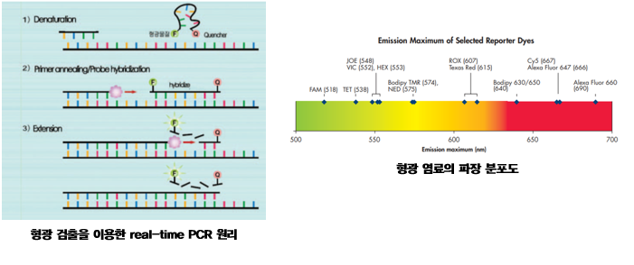
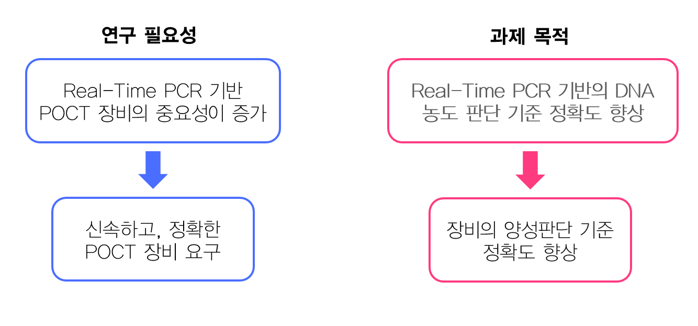
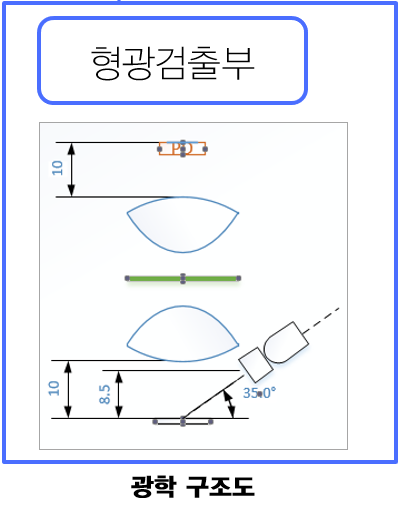
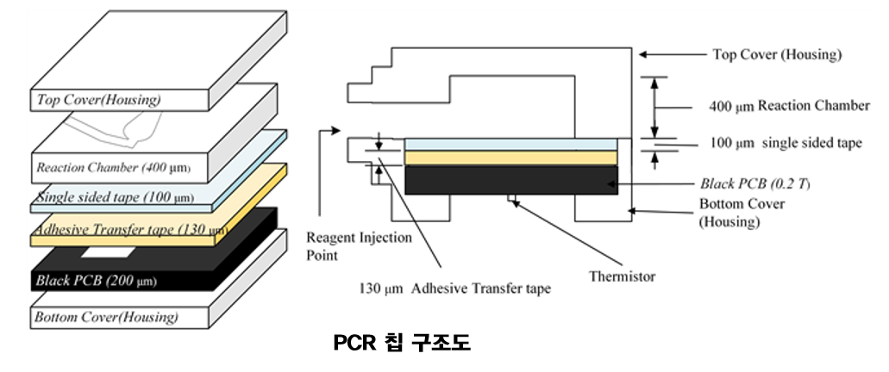
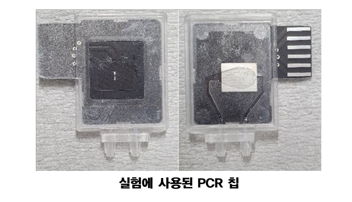
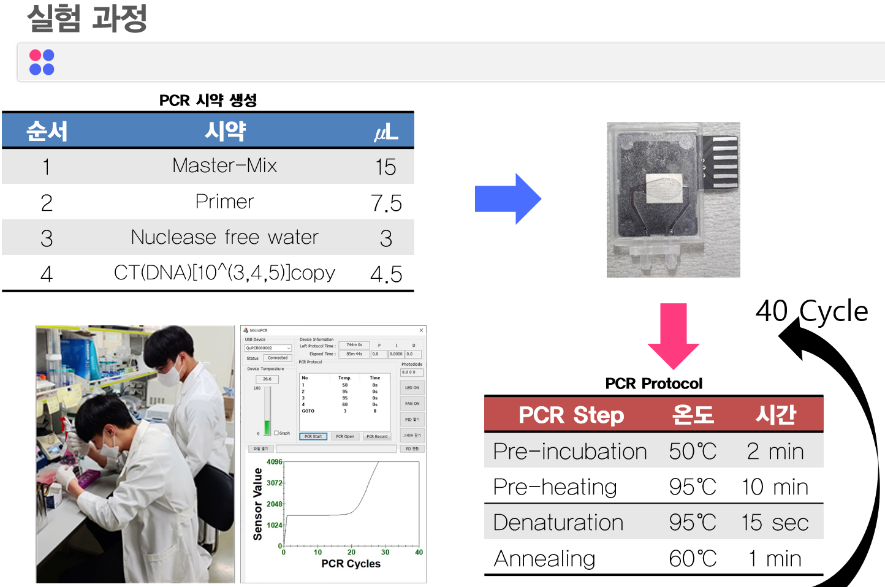
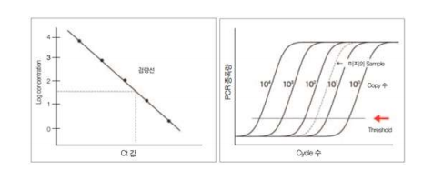
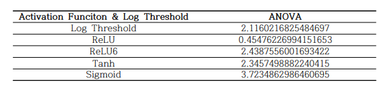

## 빅데이터 캡스톤 디자인
---
## 작품명
---
### 형광측정 PCR 장치의 양성 판정 기준(Criteria for positive determination of fluorescence measurement PCR devices)

# PCR
Positive criteria for fluorescence measurement PCR device

---
## Real-Time PCR 이란?

> 실시간 중합효소연쇄반응(real-time polymerase chain reaction, real-time PCR, qPCR)은 분자생물학에서 중합효소 연쇄 반응을 기반으로한 실험방법이다. 실시간 중합효소연쇄반응은 목표 DNA분자의 증폭과 양의 측정을 동시에 한다. DNA샘플에서 하나 또는 그 이상의 특정 서열을 위해, 실시간 중합효소연쇄반응은 검출과 양의 측정을 할 수 있게한다. 계량은 절대적인 복제 수 또는 상대적인 양을 셀 수 있다.

---
## 과제 목적

>- 최근 코로나 19와 같은 감염자가 늘어난 만큼, 진단에 필수적인 Real-Time PCR의 제작에 기여
>- 기존 PCR 장치의 형광 데이터로부터, 감염 여부를 판단하는 보다 효율적인 방법론을 제시하는 것이 목표
>- Real-Time PCR의 형광 데이터로 부터, 농도를 정확히 모르는 임상데이터가 주어졌을때, 보다 나은 양성 판정 기준을 제시하기 위해 Cycle Threshold(Ct)의 variance를 줄여야 함

---
## 과제 진행 순서

### 1. RealTime-PCR 사전조사
- 사용할 PCR 기기 광학구조 조사

- 사용할 PCR Chip 조사 및 확인

 

---

### 2. RealTime-PCR 실험
- PCR Chip 제작  

- 각기 다른 3농도에 대한 Real-Time PCR 실험 및 모니터링

---

### 3. RealTime-PCR 데이터 분석

- PCR 기기들이 사용하는 Fixed-Threshold 방식 조사 및 적용
- DNN를 이용한 Ct값 검출(Ours)
  

  
- 위 두 방법을 비교
  

  

---
## 활용 방안 및 기대효과
> 과제 내용의 결과와 같이, 1D Convolution Layer를 사용한 Neural Network로 Regression을 하여 농도 3개를 더 정확하게 구분할 수 있는 것을 확인하였다. 이는 Real-time PCR 기반 POCT 장비의 농도판정 기준이 이전 Log Threshold 방식보다 정확하다, 따라서 양성판단 기준도 더 정확하게 될 것이다. 현재는 적은 데이터의 양으로 진행하였으나 이후 데이터의 양이 증가한다면 발전 가능성이 농후하므로 이후 농도판정 기준뿐만이 아니라 양성 판정의 기준을 세워 실사용에 적용하는 것을 목표로 하여 이 연구를 계속해서 진행하겠다.
